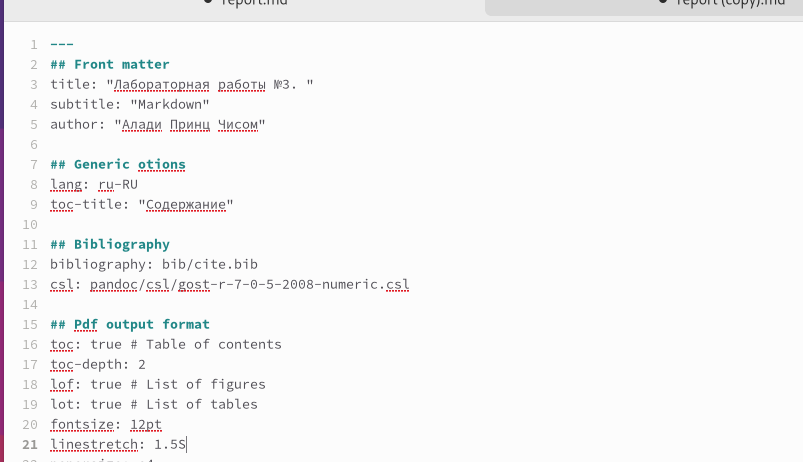
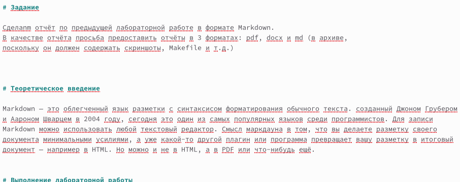
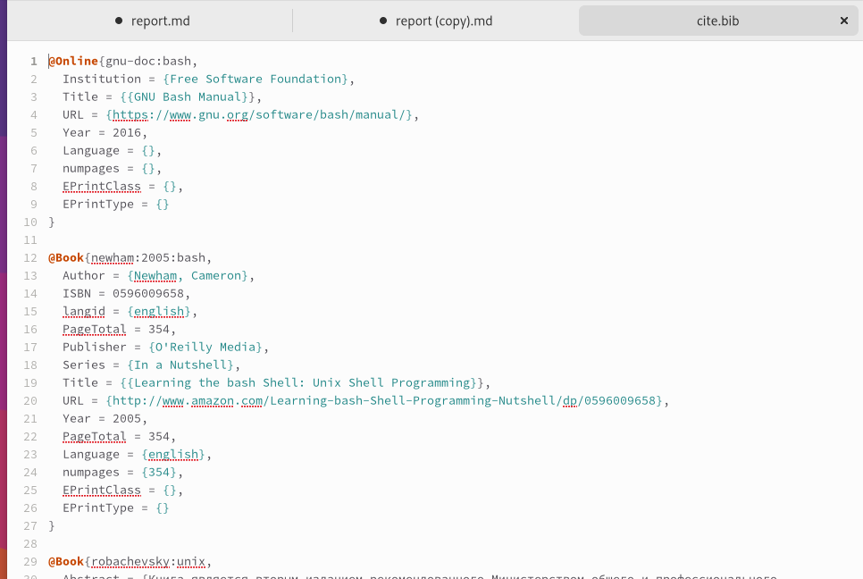
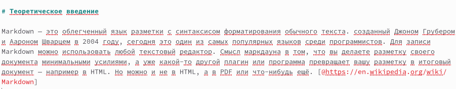

---
## Front matter
lang: ru-RU
title: Лабораторная работа №3
author: |
        Алади Принц Чисом 
        
## i18n babel
babel-lang: russian
babel-otherlangs: english

## i18n babel
babel-lang: russian
babel-otherlangs: english

## Formatting pdf
toc: false
toc-title: Содержание
slide_level: 2
aspectratio: 169
section-titles: true
theme: metropolis
header-includes:
 - \metroset{progressbar=frametitle,sectionpage=progressbar,numbering=fraction}
 - '\makeatletter'
 - '\beamer@ignorenonframefalse'
 - '\makeatother'
---

## Содержание

1. Цель
2. Основные задачи
3. Процесс выполнения
5. Список литературы

## Цель

Научиться оформлять отчёты с помощью легковесного языка разметки Markdown.

## Основные задачи

1. Освоить базовый синтаксис Markdown;
2. Сделать отчёт по предыдущей лабораторной работе в формате Markdown.

## Первый шаг

Открыли шаблон лабораторной работы. Изменили неободимые данные в соответсвии с нашей второй лабораторной работой. Изменили название и автора.(рис. [-@fig:001])

{ #fig:001 width=70% } 

Поменяли цель, теоретическое введение и задания на нужные. (рис. [-@fig:002])

{ #fig:002 width=70% } 

## Второй шаг

Поместили в папку "image" картинки, которые будем использовать. Сделали ссылки на картинки. (рис. [-@fig:003])

{ #fig:003 width=70% } 

## Третий шаг

Создадим список литературы. Для этого сначала в папке "bib" откроем файл "cite.bib" и в нем создадим по шаблону необходимые нам литературные источники. (рис. [-@fig:004])

{ #fig:004 width=70% } 

## Третий шаг

Добавим ссылки на источники. (рис. [-@fig:005])

{ #fig:005 width=70% } 

## Вывод

В процессе выполнения этой лабораторной работы я научилась работать с
языком разметки Markdown. Познакомилась с базовым синтаксисом Mardown.

## Список литературы

## {.standout}

Спасибо за внимание        
