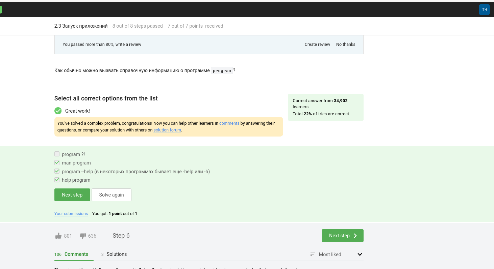
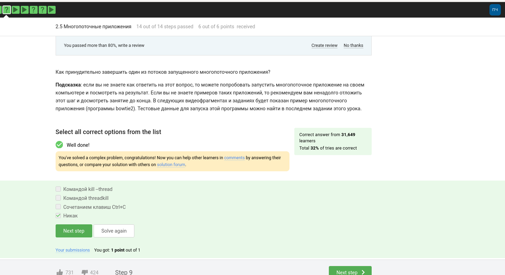

---
## Front matter
title: "Шаблон отчёта по прохождению курса"
subtitle: "Введение в Linux"
author: "Алади Принц Чисом ; Нкабд-05-22"

## Generic otions
lang: ru-RU
toc-title: "Содержание"

## Bibliography
bibliography: bib/cite.bib
csl: pandoc/csl/gost-r-7-0-5-2008-numeric.csl

## Pdf output format
toc: true # Table of contents
toc-depth: 2
lof: true # List of figures
lot: false # List of tables
fontsize: 12pt
linestretch: 1.5
papersize: a4
documentclass: scrreprt
## I18n polyglossia
polyglossia-lang:
  name: russian
  options:
	- spelling=modern
	- babelshorthands=true
polyglossia-otherlangs:
  name: english
## I18n babel
babel-lang: russian
babel-otherlangs: english
## Fonts
mainfont: PT Serif
romanfont: PT Serif
sansfont: PT Sans
monofont: PT Mono
mainfontoptions: Ligatures=TeX
romanfontoptions: Ligatures=TeX
sansfontoptions: Ligatures=TeX,Scale=MatchLowercase
monofontoptions: Scale=MatchLowercase,Scale=0.9
## Biblatex
biblatex: true
biblio-style: "gost-numeric"
biblatexoptions:
  - parentracker=true
  - backend=biber
  - hyperref=auto
  - language=auto
  - autolang=other*
  - citestyle=gost-numeric
## Pandoc-crossref LaTeX customization
figureTitle: "Рис."
tableTitle: "Таблица"
listingTitle: "Листинг"
lofTitle: "Список иллюстраций"
lotTitle: "Список таблиц"
lolTitle: "Листинги"
## Misc options
indent: true
header-includes:
  - \usepackage{indentfirst}
  - \usepackage{float} # keep figures where there are in the text
  - \floatplacement{figure}{H} # keep figures where there are in the text
---

# Цель работы

Получить практические и теоретические навыки по работе с Linux

# Задание
1.  Введение
2.  Работа на сервере
3.  Продвинутые темы

# Теоретическое введение

Linux — это бесплатная операционная система с открытым исходным кодом, которая была первоначально разработана Линусом Торвальдсом в 1991 году. Она основана на операционной системе Unix и обладает широкими возможностями настройки и гибкости, что позволяет пользователям настраивать ее в соответствии со своими конкретными потребностями.

Одной из ключевых особенностей Linux является его интерфейс командной строки, который позволяет пользователям взаимодействовать с системой с помощью текстовых команд. Это может быть пугающим для некоторых пользователей, но также обеспечивает большую мощность и гибкость для тех, кто знаком с ним.

Linux широко используется в серверах, суперкомпьютерах и встроенных устройствах благодаря своей стабильности, безопасности и надежности. Он также становится все более популярным на настольных и портативных компьютерах, особенно среди разработчиков и других технических пользователей.

Существует множество различных дистрибутивов или «дистрибутивов» Linux, каждый из которых имеет свои уникальные функции и характеристики. Некоторые из самых популярных дистрибутивов включают Ubuntu, Debian, Fedora и CentOS.

В целом, Linux представляет собой мощную и гибкую платформу для вычислений, доступную каждому, независимо от его технических навыков или образования. Его природа с открытым исходным кодом также позволяет создать активное сообщество разработчиков и пользователей, которые могут сотрудничать и вносить свой вклад в его постоянное развитие и улучшение.

# Выполнение курс

 Профиль в Stepik (рис. @fig:001).

{ #fig:001 width=70% }

1.  Введение Вопрос: как называется этот курс? Чтобы ответить, выберите правильный ответ нажмите на зелёную кнопку ниже.

{ #fig:002 width=70% }

{ #fig:003 width=70% }

1.2 Как установить Linux Какую операционную систему вы обычно используете? В таких типах задания (с галочками/чекбоксами/checkbox) вы можете выбирать несколько вариантов ответа (от 0 до всех)!

{ #fig:004 width=70% }

Что такое виртуальная машина? Выберите наиболее подходящий ответ! В таком типе заданий (с радиокнопками/radio button) ответ всегда ровно один!

{ #fig:005 width=70% }

Смогли ли вы запустить на своем компьютере Linux?

{ #fig:006 width=70% }

1.3   Осваиваем Linux

Создайте документ в OpenOffice/LibreOffice Writer (аналог Microsoft Word) и напишите в нём шрифтом FreeMono (если такого шрифта у вас нет, то используйте Arial или Times New Roman) одну-единственную строчку:
Hello, Linux!

После этого сохраните этот документ в формате XML (Microsoft Word 2003 XML) или в формате FODT (OpenDocument Text: Flat XML) и загрузите в форму ниже.

Подсказка: те из вас, кто пользуется Linux в виртуальной машине (см. первое занятие), могли заметить, что из вашей основной системы (Windows или OS X) не видно папок и файлов, созданных внутри Linux, а в Linux не видно файлов основной системы. На самом деле виртуальную машину VirtualBox можно настроить так, чтобы у обеих систем появились общие папки, но это не так просто для начинающего пользователя. Для начала предлагаем вам обмениваться небольшими файлами между вашими системами с помощью интернета, например, отправляя их на почту из Linux и получая в основной системе или, например, это задание вы можете выполнить зайдя на stepic прямо из Linux. 
Если же вас такое положение дел с обменом файлов никак не устраивает и вы готовы действовать сразу "с места в карьер", то смотрите специальное видео из второй недели про настройку VirtualBox. Однако мы рекомендуем перед просмотром пройти хотя бы начальные занятия первой недели курса (до "Терминал: основы" включительно).

Подсказка 2: если после загрузки файла отображается "ERROR", значит файл был сохранён не в XML или FODT формате. Пересохраните в нужном формате и попробуйте снова.

{ #fig:007 width=70% }

Какое расширение имеют установочные пакеты в Linux (Ubuntu)? 

{ #fig:008 width=70% }

Поставьте себе в систему плеер VLC (любым способом: через Software Center или скачиванием установочного пакета с сайта VLC).
Запустите, откройте Help → About (или Shift+F1) и напишите ниже первую фамилию (без имени!) из вкладки Authors. Обратите внимание, что в англоязычных текстах обычно имя стоит на первом месте (first name), а фамилия на втором (last name).

{ #fig:009 width=70% }

Для чего можно использовать приложение Update Manager?

{ #fig:010 width=70% }

1.4 Terminal: основы

Выберите все синонимы для “командной строки”. 

{ #fig:011 width=70% }

Какая команда напечатает в какой директории мы сейчас находимся?

{ #fig:012 width=70% }

Укажите, какие из следующих команд полностью эквивалентны команде ls -A --human-readable -l /some/directory

Подсказка: для правильного ответа на этот вопрос вам может потребоваться справка о команде ls. Напоминаем, что её можно получить с помощью команды man.

Подсказка 2: в вопросах с чекбоксами/checkbox может возникнуть ситуация, когда все предложенные варианты ответов являются неверными (варианты каждый раз выбираются случайным образом из большого набора ответов, где есть как верные, так и ложные). В этом случае вы просто не должны отмечать ни один из них (ведь мы просим указывать только верные варианты!) и нажать кнопку "Отправить"/"Submit". Возможна и обратная ситуация, т.е. все предложенные варианты верны. В этом случае отмечаете их всех и нажимаете "Отправить"/"Submit".

{ #fig:013 width=70% }

{ #fig:014 width=70% }

Какая команда используется для удаления директорий?

{ #fig:015 width=70% }

1.5 Запуск исполняемых файлов

Что произойдет, если ввести в терминал команду firefox (для запуска одноименного браузера), а затем ввести туда же команду exit?

{ #fig:016 width=70% }

Чему эквивалентен запуск программы с &?

{ #fig:017 width=70% }

Скачайте файл с программой, сделайте его исполняемым, запустите и скопируйте то, что он выведет на экран, в форму ниже.

{ #fig:018 width=70% }

1.6 Ввод / вывод

Куда по умолчанию выводится поток ошибок из программы, запущенной в терминале?

{ #fig:019 width=70% }

Какие (какая) из команд создадут файл file.txt и запишут в него поток ошибок программы program? Считайте, что в момент запуска программы файл file.txt не существует.

{ #fig:020 width=70% }

Куда деваются сообщения об ошибках (т.е. вывод в stderr) от тех программ, которые объединены в конвейер (pipe)?

{ #fig:021 width=70% }

1.7 Скачивание файлов из интернета

В каком файле на диске окажется картинка, если для её скачивания были выполнены следующие команды?

{ #fig:022 width=70% }

Какую опцию нужно указать команде wget, чтобы она не выводила никаких сообщений на экран (Resolving.., Connecting to.. и т.д.)?

{ #fig:023 width=70% }

{ #fig:024 width=70% }

1.8 Работа с архивами

Чем отличаются архиваторы gzip и zip? 

{ #fig:025 width=70% }

Какие из перечисленных программ-архиваторов могут создать архив из директории с файлами?

{ #fig:026 width=70% }

Какой набор опций нужно указать программе tar, чтобы запаковать файлы в my_archive.tar.bz2?

{ #fig:027 width=70% }

{ #fig:028 width=70% }

1.9 Поиск файлов и слов в файлах

Какая маска команды find НЕ найдет файл Alexey.jpeg?

{ #fig:029 width=70% }

Предположим, что в файле  text.txt записаны строки, показанные среди вариантов ответа. Отметьте только те из них, которые выведет на экран команда  grep "world" text.txt.

{ #fig:030 width=70% }

{ #fig:031 width=70% }

2.  Работа на сервере 

2.1 Знакомство с сервером

Для каких задач можно использовать удаленный сервер?

{ #fig:032 width=70% }

Предположим программа ssh-keygen создала вам два ключа: id_rsa и id_rsa.pub. Какой из этих ключей можно без опаски пересылать по интернету?

{ #fig:033 width=70% }

2.2 Обмен файлами 

Какая команда скопирует на сервер (в домашнюю директорию) папку stepic вместе с содержимым ее самой и всех ее подпапок?

{ #fig:034 width=70% }

Предположим, что вы устанавливаете программу program на свой компьютер при помощи команды sudo apt-get install program. Терминал сообщает вам, что он не может найти и скачать установочный пакет. Какие действия могут устранить проблему?

{ #fig:035 width=70% }

Для чего можно использовать программу Filezilla?

{ #fig:036 width=70% }

2.3 Запуск приложений

Что можно сделать, если требуется запустить на сервере программу, для работы которой нужен не терминал, а экран?

{ #fig:037 width=70% }

Как обычно можно вызвать справочную информацию о программе program?

{ #fig:038 width=70% }

{ #fig:039 width=70% }

{ #fig:040 width=70% }

2.4 Контроль запускаемых программ

{ #fig:041 width=70% }

jobs, top и ps позволяют отслеживать работу запущенных в терминале программ. В каждой из этих трех утилит для каждой запущенной программы указывается число-идентификатор. Одинаковые ли эти идентификаторы в  jobs, top и ps?

{ #fig:042 width=70% }

С помощью какой команды можно мгновенно завершить остановленный процесс?

{ #fig:043 width=70% }

Что произойдет, если использовать kill (без опций) по отношению к процессу, который был приостановлен при помощи Ctrl+Z?

{ #fig:044 width=70% }

2.5 Многопоточные приложения

{ #fig:045 width=70% }

{ #fig:046 width=70% }

Как принудительно завершить один из потоков запущенного многопоточного приложения?

{ #fig:047 width=70% }

{ #fig:048 width=70% }

{ #fig:049 width=70% }

2.6 Менеджер терминалов tmux

Вы открыли две вкладки в терминале. В одной из них вы запустили процесс и приостановили его. Переключившись во вторую вкладку и набрав fg, вы добьетесь следующего:

{ #fig:050 width=70% }

Предположим, что в tmux осталась последняя открытая вкладка. Что произойдет, если вы введете в этой вкладке в командную строку команду exit?

{ #fig:051 width=70% }

Предположим, что вы открыли терминал, зашли в нем на сервер, запустили на этом сервере tmux и начали работу в нем. Что произойдет, если вы теперь закроете терминал?

{ #fig:052 width=70% }

Что произойдет, если запустить процесс в фоновом режиме в одной из вкладок tmux, а затем принудительно закрыть эту вкладку (Ctrl+B, X)?

{ #fig:053 width=70% }

{ #fig:054 width=70% }

{ #fig:055 width=70% }

3.1 Текстовый редактор vim

Какую клавишу(и) нужно нажать на клавиатуре, чтобы выйти из редактора vim? Считайте, что вы только что открыли файл и вам сразу понадобилось выйти из редактора.

{ #fig:056 width=70% }

{ #fig:057 width=70% }

{ #fig:058 width=70% }

{ #fig:059 width=70% }

{ #fig:060 width=70% }

3.2 Скрипты на bash: основы

{ #fig:061 width=70% }

{ #fig:062 width=70% }

{ #fig:063 width=70% }

3.3 Скрипты на bash: ветвления и циклы

{ #fig:064 width=70% }

{ #fig:065 width=70% }

{ #fig:066 width=70% }

{ #fig:067 width=70% }

{ #fig:068 width=70% }

3.4 Скрипты на bash: разное

{ #fig:069 width=70% }

{ #fig:070 width=70% }

{ #fig:071 width=70% }

{ #fig:072 width=70% }

3.5 Продвинутый поиск и редактирование 

{ #fig:073 width=70% }

Задание на понимание работы опций -path и -name команды find. Отметьте все верные утверждения из перечисленных ниже.

{ #fig:074 width=70% }

{ #fig:075 width=70% }

{ #fig:076 width=70% }

{ #fig:077 width=70% }

Что произойдет, если в команде sed -n "/[a-z]*/p" text.txt не указывать опцию -n?

{ #fig:078 width=70% }

{ #fig:079 width=70% }

3.6 Строим графики в gnuplot 

{ #fig:080 width=70% }

{ #fig:081 width=70% }

{ #fig:082 width=70% }

{ #fig:083 width=70% }

3.7 Разное

{ #fig:084 width=70% }

{ #fig:085 width=70% }

Отметьте какие характеристики файла можно посчитать с использованием команды wc.

{ #fig:086 width=70% }

{ #fig:087 width=70% }

{ #fig:088 width=70% }

# Выводы

В процессе прохождения курса я приобрел навыки по работе с Linux

# Список литературы{.unnumbered}

::: {#refs}
::: {https://stepik.org/cert/2076454}
