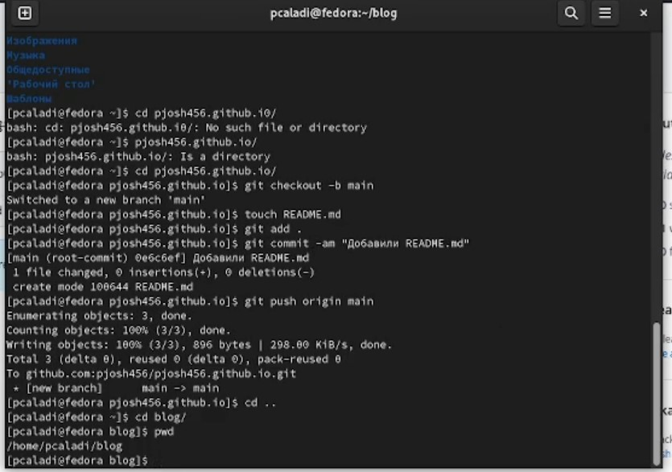

---
## Front matter
lang: ru-RU
title: Первый этап индивидуального проекта. Создание сайта
author: |
	Алади Принц Чисом, НКабд-05-22

## Formatting
toc: false
slide_level: 2
theme: metropolis
header-includes: 
 - \metroset{progressbar=frametitle,sectionpage=progressbar,numbering=fraction}
 - '\makeatletter'
 - '\beamer@ignorenonframefalse'
 - '\makeatother'
aspectratio: 43
section-titles: true
---

## Цель работы

Создать сайт на Hugo.

## Задание

1. Установить необходимое программное обеспечение.
2. Скачать шаблон темы сайта.
3. Разместить его на хостинге git.
4. Установить параметр для URLs сайта.
5. Разместить заготовку сайта на Github pages.

## Теоретическое введение

Сайт – это совокупность веб-страниц, объединённых под общим доменом и связанных ссылками, тематикой и дизайнерским оформлением. Мы будем создавать статический сайт, для этого нам понадобится Hugo.
Hugo — генератор статических страниц для интернета.

## Выполнение лабораторной работы

1. Установим необходимое програмное обеспечение. Скачаем Hugo и Go. Скачаем необходимый релиз и положим его в папку /tmp/01. Распакованный файл hugo поместим в usr/local/bin. (рис. [-@fig:001])

{ #fig:001 width=70% }

Проверим версию Hugo. (рис. [-@fig:002])

{ #fig:002 width=70% }

## Выполнение лабораторной работы

2. В качестве шаблона индивидуального сайта используется шаблон Hugo Academic Theme. Переходим по ссылке и создаем репозиторий blog (рис. [-@fig:003])

{ #fig:003 width=70% }

## Выполнение лабораторной работы

3. Выполним команду hugo server (создадутся необходимые файлы). Нам предоставят ссылку. Переходя по ней, открывается наш сайт (пока на него можно заходить только с моего компьютера). (рис. [-@fig:005])

{ #fig:005 width=70% }

## Выполнение лабораторной работы

4. Необходимо создать еще один репозиторий, чтобы наш сайт можно было открывать с любого компьютера. (рис. [-@fig:006])

{ #fig:006 width=70% }

Клонируем наш новый репозиторий. Создаем ветку main. Создаем файл README.md. Добавляем в наш репозиторий. (рис. [-@fig:007])

{ #fig:007 width=70% }

## Выполнение лабораторной работы

5. Подключаем наш репозиторий к папке public. (рис. [-@fig:008])

{ #fig:008 width=70% }

## Выполнение лабораторной работы

6. Сайт готов. (рис. [-@fig:010])

{ #fig:010 width=70% }

## Выводы

Научились создавать статические сайты с помощью Hugo.

## Список литературы

1. Командная строка Windows [Электронный ресурс]. URL:
https://foxford.ru/wiki/informatika/komandnaya-stroka-windows.

## {.standout}
Спасибо за внимание

