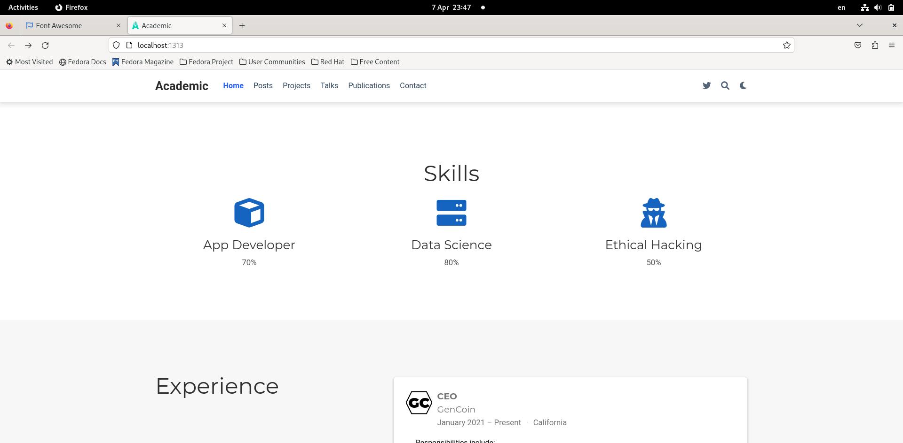
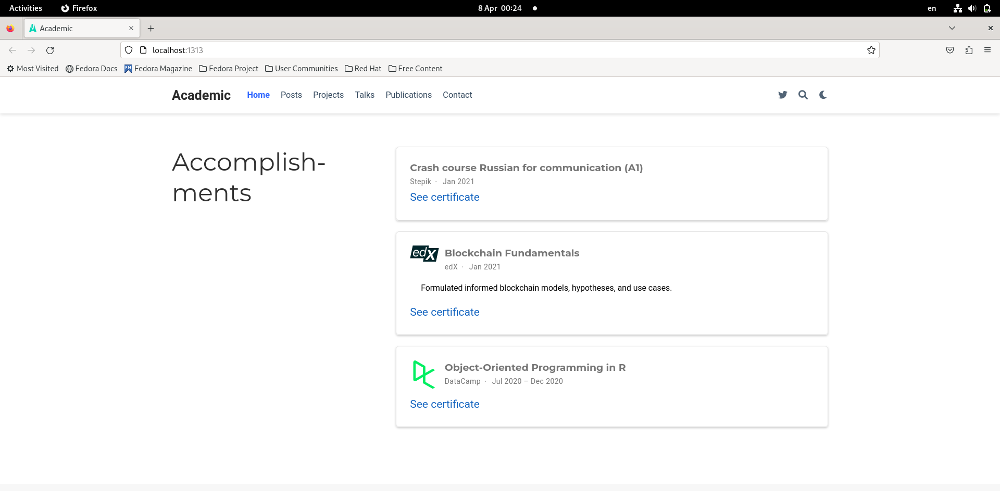
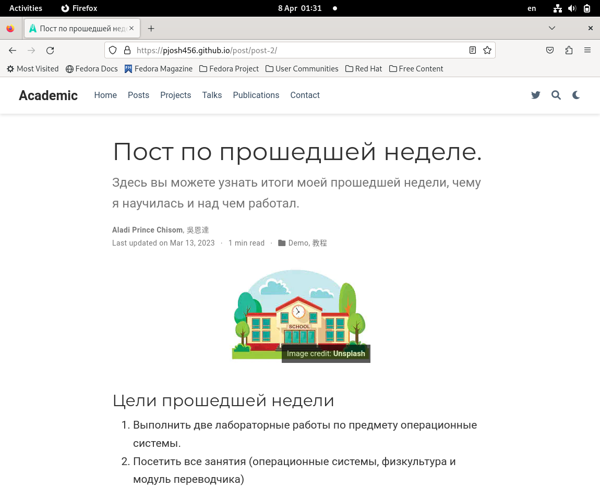

---
## Front matter
lang: ru-RU
title: Третий этап индивидуального проекта
subtitle: Предмет; операционные системы
author:
  - Алади Принц Чисом
institute:
  - Российский университет дружбы народов, Москва, Россия
  - 
date: 04 Апрель 2023

## i18n babel
babel-lang: russian
babel-otherlangs: english

## Formatting pdf
toc: false
toc-title: Содержание
slide_level: 2
aspectratio: 169
section-titles: true
theme: metropolis
header-includes:
 - \metroset{progressbar=frametitle,sectionpage=progressbar,numbering=fraction}
 - '\makeatletter'
 - '\beamer@ignorenonframefalse'
 - '\makeatother'
---

## Цель работы

Продолжить редактирование личного сайта. Добавить к сайту достижения.

## Задание

1. Добавить информацию о навыках (Skills).
2. Добавить информацию об опыте (Experience).
3. Добавить информацию о достижениях (Accomplishments).
4. Сделать пост по прошедшей неделе.
5. Добавить пост на тему по выбору:
- Легковесные языки разметки.
- Языки разметки. LaTeX.
- Язык разметки Markdown.

## Цель работы

Продолжить редактирование личного сайта. Добавить к сайту достижения.

## Задание

1. Добавить информацию о навыках (Skills).
2. Добавить информацию об опыте (Experience).
3. Добавить информацию о достижениях (Accomplishments).
4. Сделать пост по прошедшей неделе.
5. Добавить пост на тему по выбору:
- Легковесные языки разметки.
- Языки разметки. LaTeX.
- Язык разметки Markdown.

## Теоретическое введение

Сайт – это совокупность веб-страниц, объединённых под общим доменом и связанных ссылками, тематикой и дизайнерским оформлением. Мы создали статический сайт с помощью Hugo.
Hugo — генератор статических страниц для интернета.

В этом этапе проекта мы научимся добавлять на сайт наши достижения. А также я напишу пост про язык разметки LaTex.

Язык разметки (markup language) – средство описания данных и метаданных, хранящихся в документе.

## Выполнение проекта

1. Добавить информацию о навыках (Skills). (рис. [-@fig:001;-@fig:002])

{ #fig:001 width=50% }

{ #fig:002 width=50% }

## Выполнение проекта

2. Добавить информацию об опыте (Experience). (рис. [-@fig:003;-@fig:004])

{ #fig:003 width=50% }

{ #fig:004 width=50% }

## Выполнение проекта

3. Добавить информацию о достижениях (Accomplishments). (рис. [-@fig:005;-@fig:006])

{ #fig:005 width=40% }

{ #fig:006 width=40% }

## Выполнение проекта

4. Сделать пост по прошедшей неделе. (рис. [-@fig:007;-@fig:008])

{ #fig:007 width=50% }

{ #fig:008 width=50% }

## Выполнение проекта

5. Добавим пост на тему "Языки разметки. LaTeX." (рис. [-@fig:009;-@fig:010])

{ #fig:009 width=50% }

{ #fig:010 width=50% }

## Выводы

В процессе выполнения третьего этапа индивидуального проекта я продолжил редактирование сайта, научилась добавлять на сайт свои достижения, а также продолжила писать посты.

## Список литературы

1. Что такое сайт (простыми словами)l [Электронный ресурс]. URL: https: //uguide.ru/chto-takoe-sajt-prostymi-slovami.

## {.standout}

Спасибо за внимание

