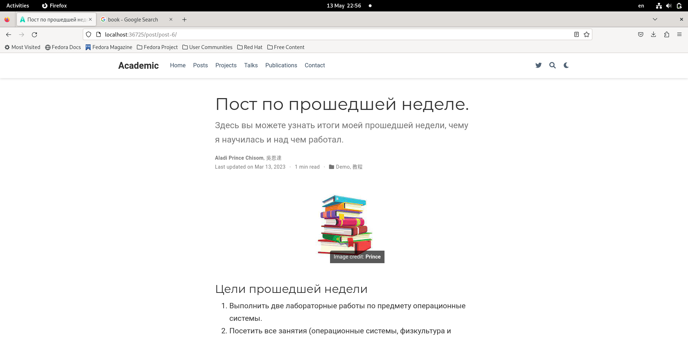
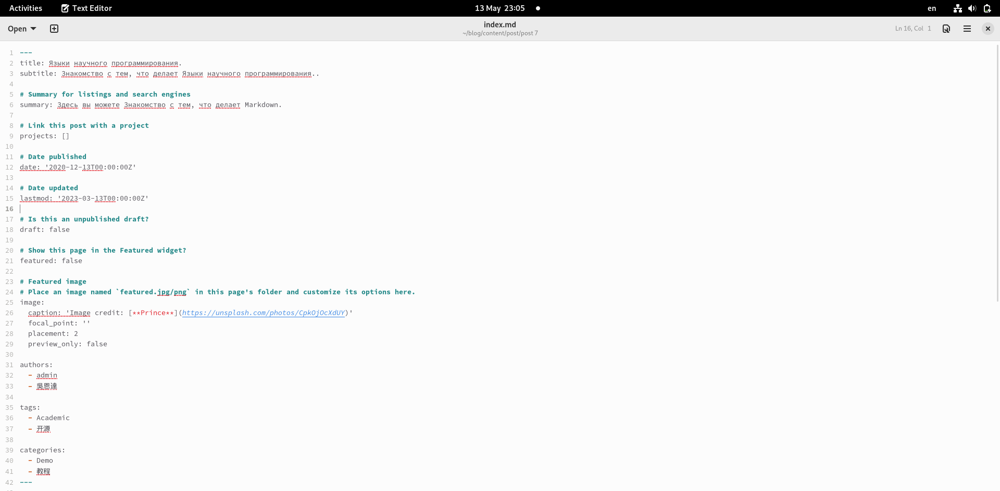
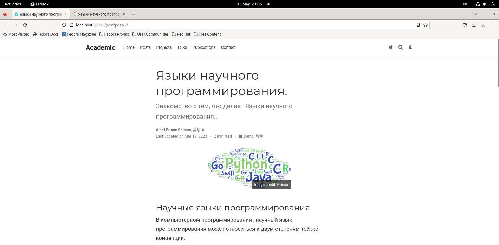

---
## Front matter
lang: ru-RU
title: Пятый этап индивидуального проекта
subtitle: Предмет; операционные системы
author:
  - Алади Принц Чисом
institute:
  - Российский университет дружбы народов, Москва, Россия
  - 
date: 27 Апрель 2023

## i18n babel
babel-lang: russian
babel-otherlangs: english

## Formatting pdf
toc: false
toc-title: Содержание
slide_level: 2
aspectratio: 169
section-titles: true
theme: metropolis
header-includes:
 - \metroset{progressbar=frametitle,sectionpage=progressbar,numbering=fraction}
 - '\makeatletter'
 - '\beamer@ignorenonframefalse'
 - '\makeatother'
---

## Цель работы

Добавить к сайту все остальные элементы.

## Задание

1. Сделать записи для персональных проектов.
2. Сделать пост по прошедшей неделе.
3. Добавить пост на тему по выбору.

- Языки научного программирования.

## Теоретическое введение

Сайт – это совокупность веб-страниц, объединённых под общим доменом и связанных ссылками, тематикой и дизайнерским оформлением. Мы создали статический сайт с помощью Hugo.
Hugo — генератор статических страниц для интернета.

В этом этапе проекта я напишу пост про языки научного программирования.  Научный язык программирования - это язык, который разработан и оптимизирован для использования математических формул и матриц .

## Выполнение лабораторной работы

1. Сделаем записи для персональных проектов. (рис. [-@fig:001;-@fig:002])

{ #fig:001 width=70% }

## Выполнение лабораторной работы

{ #fig:002 width=70% }

## Выполнение лабораторной работы

2. Сделаем пост по прошедшей неделе.  (рис. [-@fig:003;-@fig:004])

{ #fig:003 width=70% }

## Выполнение лабораторной работы

{ #fig:004 width=70% }

## Выполнение лабораторной работы

3. Добавим пост на тему языки научного программирования.  (рис. [-@fig:005;-@fig:006])

{ #fig:005 width=70% }

## Выполнение лабораторной работы

{ #fig:006 width=70% }

## Выводы

В процессе выполнения этого этапа индивидуального проекта я продолжил редактирование своего научного сайта. Научилась добавлять записи для персональных проектов.

## Список литературы

1.Что такое сайт (простыми словами)l [Электронный ресурс]. URL: https://uguide.ru/chto-takoe-sajt-prostymi-slovami.

## {.standout}

Спасибо за внимание!
